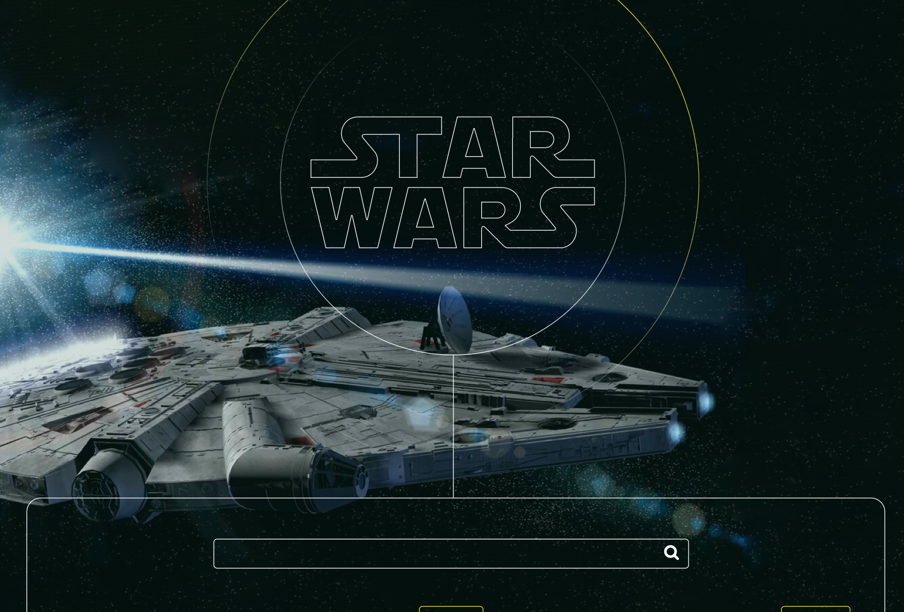
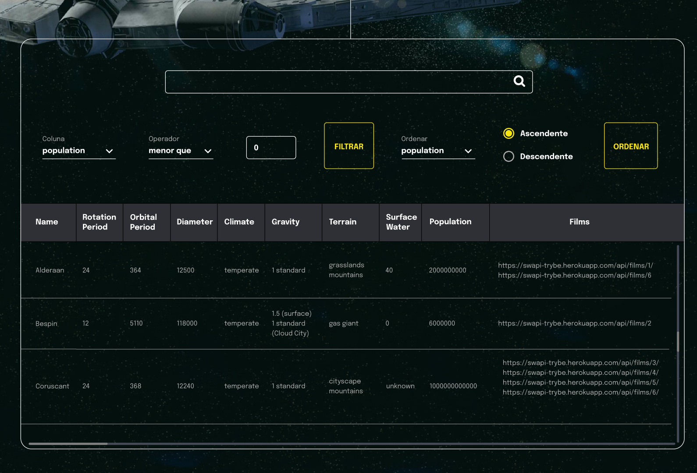

# Boas-vindas ao repositório do projeto Star Wars Planets Search!

Seja muito bem-vindo(a) ao repositório do Projeto Star Wars Planets Aqui você encontrará informações sobre o que foi desenvolvido neste projeto, bem como os principais aprendizados adquiridos durante o processo, para adquirir esse conhecimento, basta clicar na seta abaixo que o conteúdo se abrirá, boa leitura, espero que goste. 🙂
 
 
 

  
<strong>👨‍💻 O que foi desenvolvido</strong>
 

  eu desenvolvi uma lista com filtros de planetas do universo de Star Wars usando **Context API e Hooks** para controlar os estados globais.

  **Segue link do deploy de um modelo do projeto:**
  https://trybe-starwars.surge.sh/

 

  
<strong>Habilidades que eu desenvolvi realizando este projeto.</strong>
 

  Nesse projeto eu utilizei:

  * Utilizei o _Context API_ do **React** para gerenciar estado.
  * Utilizei o _React Hook useState_;
  * Utilizei o _React Hook useContext_;
  * Utilizei o _React Hook useEffect_;
  * Criei _React Hooks_ customizados.
  * Escrevi testes para garantir que minha aplicação possua uma boa cobertura de testes.

 
 
 

 
 
 

